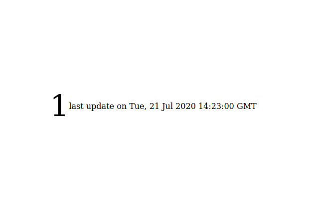

# Lessons Learned: Realtime User with Socket.IO

Simple Webapp to show how many Clients are on a Site, using [https://socket.io/](socket.io) and Nodejs as Server.



```
npm install
node server.js
```

If you use nginx,

```
upstream socketio {
    server  0.0.0.0:3000;
}

server {
    listen 80;
    listen [::]:80;

    # Host that will serve this project.
    server_name <domain>;

    # The location of our projects public directory.
    root <path>/public;

    # index File
    index index.html;

    # rewrite
    location / {
        try_files $uri $uri/ /index.html?it=$uri&$args;
    }

    location /socket.io {
        proxy_pass              http://socketio;
        proxy_redirect off;

        proxy_http_version      1.1;

        proxy_set_header        Upgrade                 $http_upgrade;
        proxy_set_header        Connection              "upgrade";

        proxy_set_header        Host                    $host;
        proxy_set_header        X-Real-IP               $remote_addr;
        proxy_set_header        X-Forwarded-For         $proxy_add_x_forwarded_for;
    }
}
```